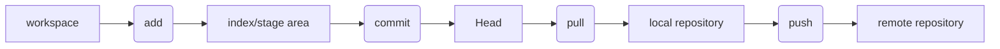

## git
### distrbute 

git init

git config --global --list

git add ./*
add all

git commint -m "message"

git push

git pull

git checkout

git fetch/clone 

git reset

git status

git log

*.gitignore
\# comment

ssh-keygen -t rsa

git remote add name url
git remote -v
git remote remove name

## github
## gitee